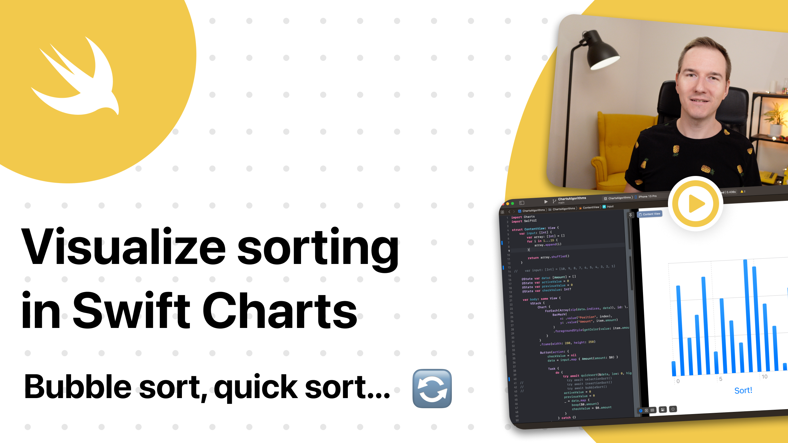

# Visualize sorting in Swift Charts

This is a code from a YT tutorial on how to use Swift Charts in a little inconvenient way 🤓 

You will learn how to code a different sorting algorithms and visualize them using Swift Charts.

## Links:
- [Link to the video](https://www.youtube.com/watch?v=UCSXF741iHI)
- [Swift Charts](https://developer.apple.com/documentation/charts)
- [Building a Signal Generator](https://developer.apple.com/documentation/avfaudio/audio_engine/building_a_signal_generator)